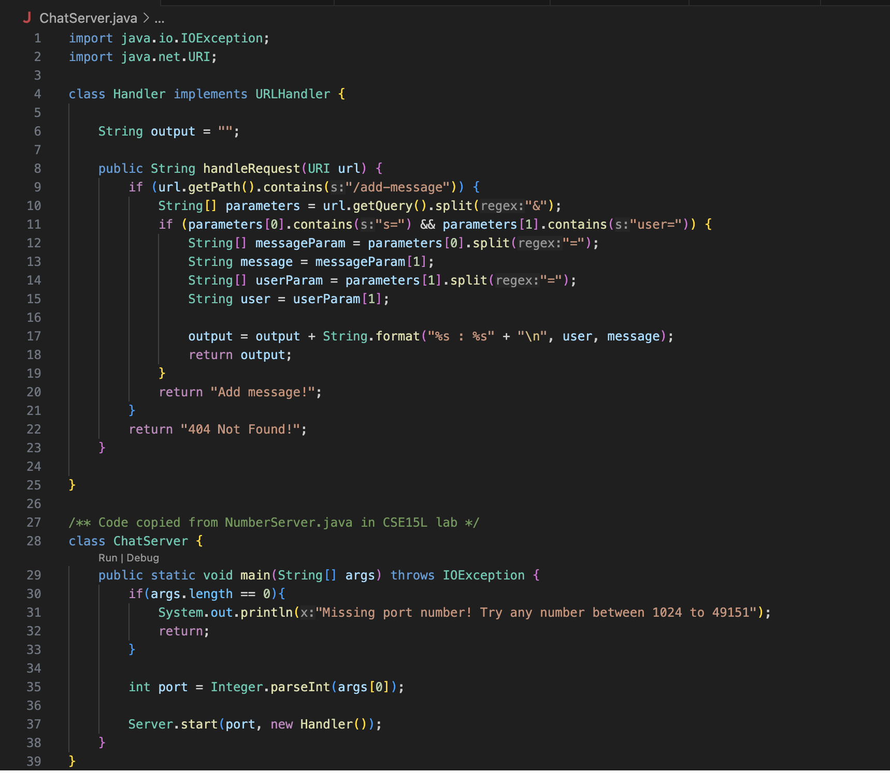
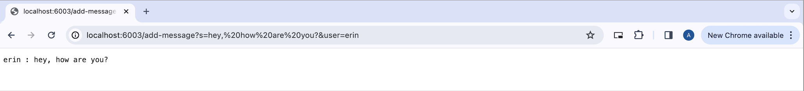
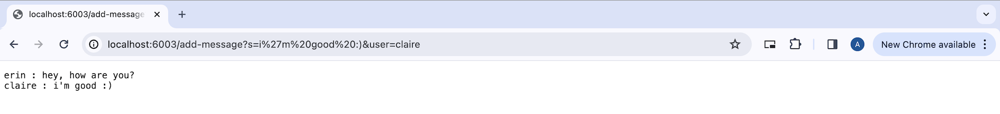

# Lab Report - 2
April 22, 2024

## Part 1

* `ChatServer.java` code:
  

* Screenshots using `/add-message`:

  * 
    1. The `handleRequest` method was called to check the url and print the message onto the webpage. 
    2. The argument to the method was a url. An important class field is one called `output` which currently stores an empty string.
    3. The `output` value was changed from an empty string `""` to the first message of type `user : message`.

  * 
    1. The `handleRequest` method was called to check the url and print the message onto the webpage. 
    2. The argument to the method was a url. An important class field is `output` which currently stores the first message that was printed. 
    3. The `output` value was changed from the first message of type `user : message` to now print two messages of the type `user : message`.

 ---

## Part 2

1. My computer - `ls` with absolute path to private key
  

2. `ieng6` machine - `ls` with absolute path to public key
  

3. Login to `ieng6` without password
  

---

## Part 3

Something new I learned it lab that I didn't know before was how to run server from a remote computer. I also learned to log into my `ieng6` account for the first time and then login without requiring a password. 

