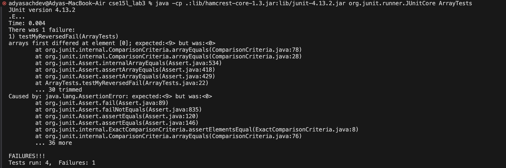
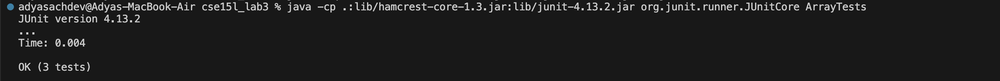

# Lab Report - 3
May 5, 2024

## Part 1 - Bugs

1. Failure-inducing input
```
  @Test
  public void testMyReversedFail() {
    int[] input1 = { 1, 9 };
    assertArrayEquals(new int[]{ 9, 1 }, ArrayExamples.reversed(input1));
  }
```

2. Non failure-inducing input
```
  @Test
  public void testMyReversedPass() {
    int[] input1 = { 0 };
    assertArrayEquals(new int[]{ 0 }, ArrayExamples.reversed(input1));
  }
```

3. Symptoms:
  - Failed test:
  
  - Passed test:
  

4. Code change:
   - Code before (bug inducing):
     ```
     static int[] reversed(int[] arr) {
        int[] newArray = new int[arr.length];
        for(int i = 0; i < arr.length; i += 1) {
          arr[i] = newArray[arr.length - i - 1];
        }
        return arr;
     }  
    ```

    - Code after (fixed):
    ```
    static int[] reversed(int[] arr) {
      int[] newArray = new int[arr.length];
      for(int i = 0; i < arr.length; i += 1) {
        newArray[i] = arr[arr.length - i - 1];
      }
      return newArray;
    }
    ```

5. To fix the code, we first need to assign elements of `arr` to `newArray` and not the other way around. Secondly, we return the `newArray` and not `arr`.


--- 


## Part 2 - Researching Commands

`grep <<string>> <<filename>>` searches files for given string and prints them to terminal

1. `grep --color <<string>> <<filename>>`
   - __Action:__ prints requirned string withing the searched files a different color
   - __Benefit:__ : increased accessibility
   - Eg1:
     ```
     adyasachdev@Adyas-MacBook-Air docsearch % grep --color "Drosophilidae" ./technical/biomed/*.txt
     ./technical/biomed/1471-2148-1-6.txt:        Species in the family __Drosophilidae__ have been premier
     ```
   - Eg2:
     ```
     adyasachdev@Adyas-MacBook-Air docsearch % grep --color "methane" ./technical/biomed/*.txt
    ./technical/biomed/1471-2121-2-10.txt:          p-amidinophenylmethanesulfonyl fluoride], 2 μM calyculin
    ./technical/biomed/1471-2121-3-13.txt:          50 mM tris(hydroxymethyl) aminomethane pH 8.0, 15 mM
    ./technical/biomed/1471-2156-3-17.txt:          Mutagenesis of SWY2089 and SWY2090 with ethylmethane
    ./technical/biomed/1471-2202-2-15.txt:          methanesulfonate (MS), 10 4-(2-Hydroxy
    ./technical/biomed/1471-2407-2-19.txt:        (azoxymethane)-induced rat models. In both models, NSAID
    ./technical/biomed/1471-2407-2-19.txt:        azoxymethane-induced colon carcinogenesis, aspirin has also
    ./technical/biomed/1472-6769-1-3.txt:        "supercharged" methane-trisphosphonic acid AppppA analogs
    ./technical/biomed/1472-6769-1-4.txt:        dichloromethane (150 mL). Anhydrous hydrogen chloride (4 N
    ./technical/biomed/1472-6769-1-4.txt:        consisting of dichloromethane, ethyl acetate and hexane
    ./technical/biomed/1472-6769-1-4.txt:        acetone in dichloromethane to afford 220 mg of 
    ./technical/biomed/1472-6769-1-4.txt:        in dichloromethane to afford 271 mg of 
    ./technical/biomed/1472-6769-1-4.txt:        6 (50 mg, 87 μmol) in dichloromethane
    ./technical/biomed/1472-6769-1-4.txt:        mg, 93 μmol) in 0.5 mL of dichloromethane. The reaction
    ./technical/biomed/1472-6769-1-4.txt:        ethyl acetate in dichloromethane to afford 34 mg of 
    ./technical/biomed/1472-6769-1-4.txt:        dichloromethane (1 mL) was added trifluroacetic acid (1
    ./technical/biomed/1472-6785-1-3.txt:        anaerobic bacteria that produce methane or hydrogen sulfide
    ./technical/biomed/1472-6793-1-8.txt:          methanesulfonate, 10 CaCl 
    ./technical/biomed/1472-6793-2-4.txt:            with tricaine methane sulfonate (MS-222, Sigma Chemical
    ./technical/biomed/1472-6890-1-4.txt:          aminomethane (Tris), pH 7.8] for 1 minute, preincubated
    ./technical/biomed/gb-2001-2-3-research0007.txt:          alkylating agents such as methylmethanesulfonate (MMS)
   ```

   - Source: [Red Switches article](https://www.redswitches.com/blog/grep-command-in-linux/)

2. `grep -i <<string>> <<filename>>`
   - __Action:__ case insensitive search and print of string instances within the files
   - __Benefit:__ easier to search places, names, etc. 
   - Eg1:
     ```
     adyasachdev@Adyas-MacBook-Air docsearch % grep -i "drosophilidae" ./technical/biomed/*.txt
    ./technical/biomed/1471-2148-1-6.txt:        Species in the family Drosophilidae have been premier
     ```
     
    - Eg2:
      ```
     adyasachdev@Adyas-MacBook-Air docsearch % grep -i "julie" ./technical/911report/*.txt  
      ./technical/911report/chapter-1.txt:    At 8:59, Flight 175 passenger Brian David Sweeney tried to call his wife, Julie. He left a message on their home answering machine that the plane had been hijacked. He then called his mother, Louise Sweeney, told her the flight had been hijacked, and added that the passengers were thinking about storming the cockpit to take control of the plane away from the hijackers.
      ./technical/911report/chapter-13.2.txt:            48. See FBI reports of investigation, interview of Julie Sweeney, Oct. 2, 2001;
   ```

   - Source: [Linux Handbook publication](https://linuxhandbook.com/grep-command-examples/)

    
3. `grep -L <<string>> <<filename>>`
   - __Action:__ filenames not containing string are printed (with the entire filepath)
   - __Benefit:__ finds files that exclude keyword
   - Eg1:
     ```
     adyasachdev@Adyas-MacBook-Air docsearch % grep -L "Julie" ./technical/911report/*.txt
    ./technical/911report/chapter-10.txt
    ./technical/911report/chapter-11.txt
    ./technical/911report/chapter-12.txt
    ./technical/911report/chapter-13.1.txt
    ./technical/911report/chapter-13.3.txt
    ./technical/911report/chapter-13.4.txt
    ./technical/911report/chapter-13.5.txt
    ./technical/911report/chapter-2.txt
    ./technical/911report/chapter-3.txt
    ./technical/911report/chapter-5.txt
    ./technical/911report/chapter-6.txt
    ./technical/911report/chapter-7.txt
    ./technical/911report/chapter-8.txt
    ./technical/911report/chapter-9.txt
    ./technical/911report/preface.txt
   ```
  - Eg2:
    ```
    adyasachdev@Adyas-MacBook-Air docsearch % grep -L "Asia" ./technical/911report/*.txt
    ./technical/911report/chapter-1.txt
    ./technical/911report/chapter-10.txt
    ./technical/911report/chapter-13.1.txt
    ./technical/911report/chapter-13.2.txt
    ./technical/911report/chapter-9.txt
    ./technical/911report/preface.txt
    ```
    
    - Source: `man grep` on terminal

4. `grep -w <<string>> <<filename>>`
   - __Action:__ only returns/prints whole word matches, and not if the desired string is part of a larger word
   - __Benefit:__ helpful to find specific words, or smaller words that are usually part of larger words
   - Eg1:
     ```
     adyasachdev@Adyas-MacBook-Air docsearch % grep -i -w "methane" ./technical/biomed/*.txt       
  ./technical/biomed/1472-6769-1-3.txt:        "supercharged" methane-trisphosphonic acid AppppA analogs
  ./technical/biomed/1472-6785-1-3.txt:        anaerobic bacteria that produce methane or hydrogen sulfide
  ./technical/biomed/1472-6793-2-4.txt:            with tricaine methane sulfonate (MS-222, Sigma Chemical
    ```
  - Eg2:
    ```
    adyasachdev@Adyas-MacBook-Air docsearch % grep -w "merit" ./technical/911report/chapter-13*.txt
  ./technical/911report/chapter-13.1.txt:                defense, or both opposed them; and because some proposals lacked merit. We have
    ```
    
    - Source: [zwischenzugs blog post](https://zwischenzugs.com/2022/02/02/grep-flags-the-good-stuff/)


